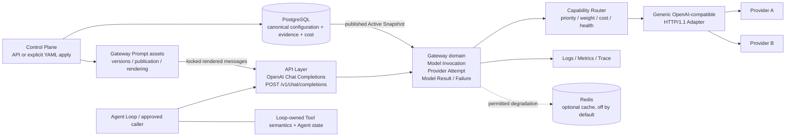
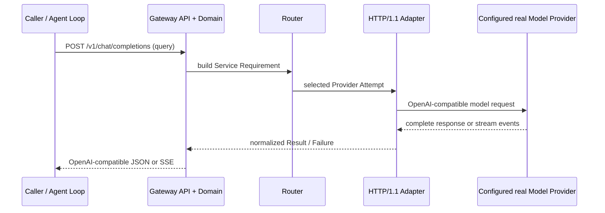

# LLM Gateway 初步范围 v0.1

- 状态：Approved
- 目的：为第一阶段实现冻结一个可交付的最小闭环；完整目标需求仍保留在 [requirements.md](requirements.md)，未列入 v0.1 的能力进入 v1 候选范围或明确保持在外部系统。
- 原则：一次逻辑 Model Invocation、一个统一内部协议、一个可解释的路由/弹性边界；不因 Provider、SDK 或部署形态改变领域模型。

## 范围图

2026-09-13 范围变更：[ADR-0148](adr/0148-gateway-owned-basic-prompt-management.md) 已将基础 Prompt 模板资产、不可变版本、显式发布及渲染纳入 Gateway。此前相冲突的 Prompt 排除描述以本次变更为准；Tool 执行、Agent 循环、Session/Memory 仍在外部。实现及验证进度以[六项基本能力验收清单](basic-capabilities.md)为准，纳入范围不代表已经完成。

## 六项基本能力：Gateway 范围内

后续明确的限速要求：每个逻辑模型在 `model_aliases` 定义中配置 `requests_per_minute`，默认 5；单实例滚动 60 秒窗口，同步/SSE 共用，超限返回 429，内部重试/fallback 不重复扣减。该新增字段修订旧 Alias DTO 的闭合字段范围，详见[模型 RPM](model-rate-limit.md)。不把 Provider QPS 或 Binding 并发当作本项 RPM。

根据用户“先放入 gateway 范围”的确认，以下六项全部属于 Gateway v0.1 必须交付范围，不作为外部调用方的补救责任，也不推迟为 v1 候选：

| 能力 | Gateway 负责的边界 |
| --- | --- |
| 自有协议 | 定义自己的请求、响应、Usage、错误与流事件；供应商对象不得直接透传到应用层。 |
| Provider 抽象 | 在 Adapter 内吸收供应商差异；上层使用统一接口和逻辑模型名，切换不要求修改业务请求，实际模型仍可追踪。 |
| Prompt 管理 | 将模板作为版本化资产管理，提供不可变版本、显式发布、版本锁定和受限渲染，避免散落在业务代码中。 |
| 重试与 fallback | 区分可重试、仅可降级和必须失败的错误；检查候选的能力要求，遵守预算、截止时间及取消，不将协议兼容等同于质量等价。 |
| 流式边界 | 输出提交后不能静默切换模型；失败流明确失败并关闭，不发送成功 DONE，不拼接不同模型输出。 |
| Trace 与可观测性 | 关联 request_id、call_id、trace_id，记录 actual_model、Attempts、Token、Cost、Latency，并保留未知或部分数据的真实状态。 |

本次先登记范围，不据此宣布实现完成、开启尚未验收的 HTTP 流式能力或扩大到 Agent/Tool 执行。逐项验收标准、实现缺口和验证证据统一维护在[六项基本能力验收清单](basic-capabilities.md)，避免范围文档与验收状态混用。



## v0.1 端到端硬门槛



`v0.1` 必须能够在已发布配置、有效 Secret Reference 和可访问的 OpenAI-compatible Provider 条件下，真实发送一次 Query 到大模型并把结果返回调用方。真实 Smoke 的最小拓扑是一个 Provider、一个 Model Binding 和一个 Model Alias；多 Provider、fallback 和复杂路由仍属于 v0.1 能力，但通过 MockTransport/独立策略测试验证，不阻塞首次真实调用。至少要求同步请求闭环；Provider 支持时同时验证 SSE 闭环。MockTransport 只用于 CI 的协议、路由和故障测试，不能替代一次真实 Provider Smoke 验证；Smoke 环境不得把凭据写入代码、日志或文档。

## Docker 后的最小可用路径

1. 执行默认 Docker Compose/等价 Docker 启动，启动 Gateway、PostgreSQL 和 `gateway-migrate`；Redis 只在显式启用 `cache` profile 且配置打开缓存时启动。
2. 通过 Control Plane API（`production` 模式需授权；`dev` 模式跳过 Gateway API 校验）或一次显式 YAML apply API 提交 Provider、Model Binding、Model Alias、路由和 Secret Reference，完成 validate → Candidate → publish。禁止手工写 PostgreSQL 表，禁止依赖容器内私有脚本才能完成发布。
3. 等待 Gateway 的 Data Plane admission readiness；Provider 暂时不可达不改变 readiness，但会在实际调用时返回统一 Provider/route 错误。
4. 调用公开的 `POST /v1/chat/completions`，由 Gateway 完成认证、路由、真实 Provider 请求和结果翻译；调用方不接触 Provider URL 或密钥。
5. 使用同步 Query 作为最小成功标准；Provider 支持流式时，使用 `stream=true` 验证同一配置下的 SSE 闭环。一个真实 Provider、一个 Model Binding 和一个 Model Alias 即可满足最小 Smoke 拓扑。

因此，`docker compose up` 后不能只证明进程存活；必须能通过文档化 API 完成配置发布并调用真实大模型。配置 API、Data Plane API、readiness 和真实 Provider Smoke 共同构成 v0.1 的端到端交付门槛。

### API 顺序（不含凭据值）

```text
docker compose up -d
        ├─ gateway-migrate (repeatable one-shot versioned PostgreSQL Schema migration)
        ├─ host 127.0.0.1:8001 → gateway:8001 (process 0.0.0.0:8001; Control Plane + health)
        │
        ├─ GET  /gateway/v1/config/active
        ├─ GET  /gateway/v1/config/revisions
        ├─ GET  /gateway/v1/config/revisions/{revision}
        ├─ GET  /gateway/v1/config/revisions/{revision}/export
        ├─ POST /gateway/v1/config/validate
        ├─ POST /gateway/v1/config/revisions
        ├─ POST /gateway/v1/config/revisions/{revision}/publish
        ├─ POST /gateway/v1/config/revisions/{revision}/rebase
        ├─ POST /gateway/v1/config/revisions/{revision}/rollback
        ├─ GET  /healthz (liveness, internal/编排 listener)
        ├─ GET  /readyz  (Data Plane admission readiness, internal/编排 listener)
        └─ host 127.0.0.1:8000 → gateway:8000 (process 0.0.0.0:8000; Data Plane)
           ├─ POST /v1/chat/completions
           ├─ GET  /gateway/v1/invocations/{call_id}
           ├─ POST /gateway/v1/invocations/{call_id}/cancel
           ├─ GET  /gateway/v1/invocations/by-idempotency-key
           └─ POST /gateway/v1/invocations/by-idempotency-key/cancel
```

首次配置也可以由受控 YAML 作为导入内容提交，但仍必须经过同一套 API/应用层校验和显式 publish；只要 Active 仍为空，Gateway-native JSON/YAML 就可使用保留的 `base_revision: "0"` 创建多个独立 null-base Candidate，用新 Revision 纠错而不编辑旧 Candidate，随后由一个 Candidate 原子赢得首次发布并使其余变为 Stale。v0.1 提供完整的 Minimal Configuration Bundle（一个 Provider、一个 Binding、一个 Alias，以及显式 routing/pricing/safety registry 与 Gateway-wide resource singleton）；可选输入 `replay_policies` 缺失时在 resolved Snapshot/export 中物化为 `execution_dedup_only`，启用精确回放时必须显式完整配置。Gateway 不隐式补齐必需领域 section。启动脚本、容器内部私有命令和直接写 PostgreSQL 都不是 v0.1 的成功路径。

## v0.1 必须交付

### 1. 部署与边界

- 单 Gateway 实例，Docker 启动；PostgreSQL 是唯一配置与运行时快照权威，Redis 属于显式 `cache` profile 的可选、默认关闭缓存组件。profile 本身不打开缓存策略；默认 Redis 使用临时存储、不要求命名卷或权威备份；未启用 Redis 或缓存策略时，live 路径不增加隐式依赖。
- Redis endpoint、TLS/transport 参数和缓存 Secret Reference 属于部署/Bootstrap Configuration；缓存 `enabled`、fresh/stale 窗口、降级原因和保留策略属于 PostgreSQL Active Snapshot。调用方与 domain YAML 不得覆盖 Redis 连接，Bootstrap 也不得隐式打开缓存策略。连接配置只在重启或显式 Bootstrap reload 后生效，禁止自动文件热更新；每个已接纳调用锁定准入时的 Cache Backend Connection Profile 和缓存策略规则，后续调用才使用新 profile/策略。
- 即使 Active Snapshot 已打开缓存但 Redis profile 或连接配置缺失，仍可发布；调用时内部标记 `cache_backend_unavailable`，不做缓存 I/O，不改变 `/readyz`、live 路由或既有终态，也不向调用方暴露该状态或 Redis 细节。Redis 恢复后，后续符合条件的调用自动恢复缓存使用，无需重启或重新发布。禁用或重新启用缓存策略只影响随后接纳的调用；每次调用按准入时锁定的策略版本/状态、逻辑计时状态和连接 profile 决定其缓存读写规则，已接纳调用不被后续发布改变。禁用期间策略逻辑 freshness/stale 计时暂停且不同步清空 Redis；以相同策略版本重新启用时，从禁用前的逻辑时间点继续，仅复用仍存在且满足 key、隔离、TTL/保留、撤销和当前密钥条件的条目，强制失效需显式撤销或提升策略/语义版本。显式缓存撤销或缓存加密密钥轮换/撤销可覆盖已接纳调用的缓存资格，但不取消其 live 模型工作；安全撤销线性化前已开始但尚未返回的缓存命中会被丢弃，已返回的结果不追溯撤回。这是单次请求的 Gateway 快照，不是 Agent Session 或调用方 session_id。
- 安全撤销若丢弃了已耗尽 live 路径后的缓存命中，则返回原已分类的终态，不重新请求或暴露撤销细节。
- Data Plane 与 Control Plane 同一进程内分为逻辑 API 面；独立 Data Plane 服务、多实例协调和分布式 Circuit 延后。
- v0.1 的 Bootstrap 解析只产生一个授权模式。源配置省略 `startup_profile` 时解析为 `dev`；有效 profile 为 `dev` 且省略授权模式时解析为 `dev_bypass`。有效 profile 为 `production` 时必须显式选择 `local_jwt` 或 `online_authority`，不得使用 bypass；不支持组合、fallback 或降级，且 `online_authority` 不存在 development transport 变体。发布的 Docker 示例即使采用默认值也要显式写出 profile 与授权模式，两项解析结果进入 Bootstrap digest。Gateway 容器监听 `0.0.0.0:8000/8001`，但默认 Compose 只发布到宿主机 `127.0.0.1`。`dev_bypass` 跳过所有 Gateway API 的 JWT/权限校验并合成完全固定的 Development Authorization Context：`subject=dev`、`tenant_id=dev`、`issuer=urn:llm-gateway:dev`、`audience=llm-gateway`、`expires_at=9999-12-31T23:59:59Z`、`scopes={dev:*}`、`authentication_method=dev_bypass`；`dev:*` 只是 bypass 标记，不是通配权限。
- `online_authority` 是版本化的通用 HTTP JSON introspection/context Adapter，只把 credential 转成规范化 Authorization Context 并分类认证/依赖结果；Gateway 自己执行 route-to-scope 矩阵。产品专用系统通过该 Adapter 或 sidecar 集成，Gateway 不保存 user、role、group 或 policy。跨 credential refresh 的稳定 `subject` 由 Adapter 保证并用“刷新前/后同一主体”成对 fixture 验证；运行时仅检查类型、格式和非空，不持久化主体映射。以后出现另一个合法 `subject` 时，将其视为另一主体及另一 Idempotency Namespace，而不是检测为不稳定。
- Authorization Context 的 `subject`、`tenant_id`、`scopes`、`issuer`、单一已匹配逻辑 `audience`、`expires_at` 和 `authentication_method` 都必需；`scopes` 可以是空集合。`subject`、`tenant_id` 是 1–255 UTF-8 字节的不透明字符串，`issuer` 是 1–2048 字节，`audience` 是 1–255 字节；这些字符串含控制字符或首尾空白时拒绝，不 trim、不转换大小写、不做 Unicode 规范化。`expires_at` 是 UTC Instant；`authentication_method` 只允许 `dev_bypass | local_jwt | online_authority`，表示验证路径而非 Token 格式。`tenant_id` 暂时只用于命名空间隔离和关联，不扩展租户设计。
- 除 `dev_bypass` 完全忽略 Header 外，认证只接受一个原始、未合并的 `Authorization` Header：Scheme `Bearer` 大小写不敏感，其后恰好一个 ASCII SP，再跟 1–16384 字节 ASCII `token68`。重复/逗号合并 Header、OWS、额外空白、控制/非 ASCII 字节、空值或非法 token68 均为 401；不 trim、split 或解码。所有认证 401 都只带通用 `WWW-Authenticate: Bearer`，不泄漏具体原因。
- `local_jwt` 是闭合 Bootstrap 分支：只允许 mode、一个只读挂载 key file 及 `pem|jwks` 格式、issuer、target audience 和 PEM-only `kid`；禁止 inline、环境变量、URL/远程与 SecretSource key。文件最大 256 KiB、启动只读一次，变化必须重启。PEM 恰好一个 SPKI/PKCS#1 RSA public object；JWKS 最多 32 keys，只以 `kty=RSA`、`n`、`e` 为 Key 真值，每个 `kid` 是唯一的 1–128 visible ASCII；可选 `alg/use/key_ops` 必须分别为 `RS256/sig/verify-only`。有界证书 metadata 可忽略但不建立信任，私钥参数或远程 locator 拒绝。v0.1 仅允许 2048–4096 位 RSA/RS256；静态错误使 Data Plane non-ready，远程 JWKS/在线轮换延后。
- `local_jwt` 固定要求 `sub`、`tenant_id`、`iss`、`aud`、`exp`，可选 `nbf`、`iat`、`scope`；issuer 精确匹配，`aud` 可以是字符串或无重复字符串数组，但必须包含配置 Audience，Context 只保留该值。`scope` 可以是 ASCII-SP 分隔字符串或字符串数组，缺失映射为空集合，未知 Claim 忽略。三个时间 Claim 只接受整数 NumericDate；固定 30 秒时钟余量，要求 `now+30s >= nbf`、`iat <= now+30s`，Context `expires_at=exp+30s` 且相等时已过期，不另设最大 Token 生命周期。任何 Token 解析、必需 Claim、类型、mapping 或最终 Context 校验失败都是 HTTP 401，不重新归为 Adapter-success 503。
- `local_jwt` 编码值最大 16 KiB，解码 Header/Payload 分别最大 4/12 KiB；只接受三个 canonical 无 Padding base64url JWS Compact 段和无重复键、无非有限数值的严格 UTF-8 JSON Object。拒绝 `crit`、`zip`、`jwk`、`jku`、`x5u`；`typ` 可省略，存在时只能是 `JWT` 或 `at+jwt`。`online_authority` 的明确 unauthenticated 决定为 401；依赖不可用为 `authorization_unavailable`/503（内部原因为 `authority_dependency_unavailable`）。只有 Adapter 已判定认证成功、但规范化 Context（包括 Authority 返回的 scope）仍违反字段契约时，才返回 `authorization_context_contract_invalid`/503；该 request-local 故障本身既不关闭 Probe Gate，也不设置新的 Live Fault，但底层协议有效的 live decision 仍可按 generation 规则清除已有 Live Fault，从而恢复聚合 readiness。权限不足为 403。授权失败均不重试、不带 `Retry-After`、不执行 Provider 工作。
- 除 `dev_bypass` 的合成标记 `dev:*` 外，scope 必须是匹配 `^[a-z][a-z0-9]*(?:[._-][a-z0-9]+)*$` 的 ASCII 字符串；单项最多 128 字节，去重后最多 64 项、合计最多 4096 字节。合法未知 scope 保留在不可变 Context 中但不授权。授权采用大小写敏感的精确匹配；不支持 `*`、前缀、层级或 `admin` 蕴含。v0.1 闭合集合为 `gateway.model.invoke`、`gateway.model.provider_override`、`gateway.invocation.read`、`gateway.invocation.cancel`、`gateway.config.providers.write`、`gateway.config.bindings.write`、`gateway.config.routing.write`、`gateway.config.pricing.write`、`gateway.config.safety.write`、`gateway.config.resources.write`、`gateway.config.replay.write`、`gateway.config.read`、`gateway.config.export`、`gateway.config.publish`、`gateway.config.rollback`、`gateway.audit.read`、`gateway.cost.reconcile`。Chat Completions、Provider override、生命周期 read/cancel 和配置 read/export/publish/rollback 分别要求对应 scope；Bundle/typed Change Set 的 validate、create、rebase 要求其触及各领域 write scope 的并集，缺任一项则整体 403 且无部分结果或写入。
- `online_authority` 是 production-only 的闭合 Bootstrap 分支，只含 `live_endpoint`、`probe_endpoint`、`authority_id`、`live_service_token_secret_ref`、`probe_service_token_secret_ref` 和非空 canonical CIDR allowlist。两个固定且不同 path 必须同 origin；始终要求 HTTPS、TLS 1.2+、证书链/主机名校验，并拒绝 userinfo、query、fragment、redirect、请求目的地覆盖、HTTP、loopback/private 和环境代理。每条新连接重新解析 DNS，所有地址均须通过 allowlist/目的地策略，混合答案整体拒绝；没有 development 例外。
- 实时 introspection 固定 `POST`、UTF-8 `application/json`、`Accept: application/json`、identity encoding 且不压缩请求。闭合 JSON 只含 `protocol_version="gateway.authorization.introspection/v1"`、`credential_type="bearer"`、`credential`；后者是完成 Bearer 语法校验并移除 `Bearer ` 后的原始 Token，不 trim 或规范化。拒绝未知/重复字段。只有 200 是决定：闭合 `authenticated` envelope 精确携带 Context 六个来源字段和 scopes，Gateway 合成 `authentication_method=online_authority`；闭合 `unauthenticated` 不带身份字段并返回 401。204、3xx、其他非 200（包括 Authority 对 Gateway 服务凭据返回的 401/403）、协议/Content-Type/charset/JSON/Schema 错误都属于 `authority_dependency_unavailable`/503；200 authenticated 后仅 Context 字段校验失败仍是 request-local 503，其本身既不关闭 Probe Gate，也不设置新的 Live Fault，但底层协议有效的 live decision 仍可按 generation 规则清除已有 Live Fault，从而恢复聚合 readiness。
- Authority live 与 Probe 的 SecretSource 各返回一份不同的 1–16384 字节 ASCII `token68` 原始服务 Token：至少一个字母/数字/`-._~+/`，其后只允许尾随 `=`；不含 Scheme、空白、控制字符、非 ASCII、逗号或内部 `=`。Adapter 不 trim、split、decode、补齐或规范化，只固定组装 `Authorization: Bearer <token>`。每次 live/Probe 操作在 2 秒 deadline 启动后只解析对应 ref 一次，Secret resolve 与 HTTP 共用该 deadline；明文只存在于 operation-scoped Lease，并在所有退出路径销毁，不跨操作缓存。Authority 返回 401/403 时丢弃本 Lease、不在本请求重试，后续操作重新解析。它们与 caller Token 互不替代；请求体、认证 Header、credential、原始响应及原始异常不进入 Logs、Trace、Metrics、Evidence、配置导出或错误响应。
- Authority 使用两个互不共享连接/凭据/permit 的 direct HTTP/1.1 pool：live 容量 64、Probe 容量 1，都没有隐藏 acquisition queue，library retry 为 0，idle 30 秒、maximum lifetime 5 分钟。Secret resolve、pool acquisition、DNS/allowlist、connect、write、read 共用单一 2 秒 deadline，live 还受调用方剩余时间约束；新连接每次重新 DNS 校验。live 和 Probe 响应都最多 64 个 Header、16 KiB Header 总量、64 KiB 解码后 JSON，且只接受 identity content encoding。只有 live Secret/Token、DNS/allowlist/TLS/connect/write/read、完整 2 秒 Authority timeout、非 200 或响应资源/编码/媒体/UTF-8/JSON/协议/envelope 失败会设置 Live Fault。调用方断开/取消、Gateway shutdown、仅由更短 caller deadline 导致的 timeout、本地 live 容量耗尽保留各自请求结果但不设置或刷新 Latch；任何失败都不创建 admission 或 Provider 工作。
- `online_authority` 对外 readiness 仍是进程内 `unknown | available | unavailable`，启动时为 `unknown`，但初次 Probe 完成前观察到符合上述 allowlist 的 live Fault 会立即变为 `unavailable`。内部由 Probe Gate 与 Live Fault Latch 聚合：启动 Probe Gate 未决；只有协议有效 Probe 成功打开它，Probe 不得清除 Live Fault。只有符合 allowlist 的 Authority/服务凭据依赖失败锁存 Fault，更晚 generation 的协议有效 live 200 `authenticated|unauthenticated` 决定可清除，live 成功也不打开 Probe Gate。两门都通过才 `available`；monotonic generation 阻止旧完成覆盖新状态。只要 Probe Gate 已开，所有本来需要在线认证的 Data Plane/Control Plane 请求都可在一般 Data Plane readiness 前执行普通 live 认证，不要求 Live Fault 是全局唯一 blocker；清除后同一请求再走各自 permission、PostgreSQL、配置恢复或 Data Plane readiness，unauthenticated/Context-invalid 仍返回 401/503。`/readyz=503` 时直接 listener 仍接收请求，恢复并发只受既有 live 64 限制；不增加 single-flight、共享认证结果、synthetic canary 或 reset API。启动后立即 Probe，之后每 5 秒最多一个、单次 2 秒且不重试；`/readyz` 只读本地聚合。Bootstrap `authority_id` 保持既有精确 profile，Probe wire 保持已冻结 JSON。v0.1 不做防抖、Circuit、退避或状态持久化；本地/Dev 模式无此依赖。
- Model Invocation 在原子 Admission Checkpoint 提交前，用 PostgreSQL 数据库时间最后检查 `Authorization Context.expires_at > now`；相等或已过期按普通认证过期结果结束，不创建 Invocation/Attempt/Evidence/Cost/Provider 工作。提交后本次 Invocation 不再检查授权过期，排队、同步生成或 SSE 跨过该时刻仍继续；后续 Status、Cancel、Replay 是独立请求并重新认证。
- 准入前授权失败不创建 `call_id`、Model Invocation、Invocation Evidence、Cost Ledger 条目或 PostgreSQL 授权健康记录；只写安全结构化 Log、OTel HTTP/Auth Span 和低基数 Metrics。仅 Log/Span 可记录 request/trace identity、拓扑、Adapter 版本、规范化原因与延迟；Metrics 只允许有界的拓扑、Adapter 版本、规范化原因/结果和延迟维度，不得携带请求或 Trace 级 ID。所有信号都禁止记录 Token、Claims、`subject`、`tenant_id`、Authorization Authority endpoint、Authority 原始响应或异常。
- Provider 凭据只保存 Secret Reference，运行时在 Adapter 边界解析，不进入调用方请求或普通遥测。
- v0.1 Smoke 默认通过 Docker Secret 或挂载文件提供 Provider 凭据；`dev` 可显式启用命名环境变量 SecretSource，禁止自动加载 `.env`。`production` 只允许受控挂载 Secret/Docker Secret 或专用 Secret Manager，凭据值不得进入 PostgreSQL、配置 API、调用方数据或普通遥测。
- Bootstrap 的 Idempotency Index Key Ring 是进程生命周期不可变 descriptor：恰好一个 active、最多 8 个 verification-only。每个成员恰含 `key_id`、`key_version`、`role`、`secret_ref`；`(key_id,key_version)` 与完整 `secret_ref` 各自唯一，同一 `key_id` 可有多版本。每个 ref 必须指向一个精确不可变版本而非 bundle/current；SecretSource 返回的 identity/version、HMAC profile metadata 和恰好 32 个 raw bytes 必须匹配，禁止隐式 latest、解码、派生、补齐或截断。新绑定只用 active；新 active 或成员变化只经重启生效，v0.1 不提供热加载/轮换 API、不重建索引、不自动淘汰旧版本。
- Bootstrap 另含独立 `gateway.fingerprint-key-ring/v1`：Request/Execution Fingerprint 共用一个 active 和最多 8 个 verification-only 成员，每项只含 `key_id`、`key_version`、`role`、`secret_ref` 并解析为恰好 32-byte HMAC-SHA-256 原始材料。descriptor 在进程生命周期内不可变，只能重启轮换；active 启动解析失败使 Data Plane non-ready，历史成员按需解析失败只令该历史访问返回 `persistence_unavailable`。它不与 Idempotency Index、cache 或 Replay key 共用，Routing seed 本身不延长旧 key 保留期。
- PostgreSQL 以 `(key_id,key_version)` 保存非内容 Fingerprint Key Protection Horizon，并在 Idempotency admission、cache/Replay retention handoff 前用数据库时间单调推进。计划移除仍受保护版本会使启动 non-ready；SecretSource/Redis 不可用、缓存 miss 或存储不确定不能证明已无依赖。只有审计过的 PostgreSQL security invalidation 能释放明确撤销的依赖，普通路径不得缩短 horizon，也不扫描 Redis。
- Protection row 固定为 `key_id/key_version/protected_until/invalidated_at/invalidation_generation/updated_at`。普通路径只能提高 horizon；安全操作只能对整个版本一次性、不可逆地写入数据库时间与 generation，使该版本的全部历史 Fingerprint 比较、cache 和 Replay 依赖永久不可用。相同版本不能恢复或重用；撤销 active 会持续 non-ready，必须重启并配置不同 active version。
- Startup active-key probe 立即释放材料。新 execution 在 auth/protocol preflight 与 Idempotency Index resolution 后、Request Fingerprint/admission 前，只解析一次 active key，deadline 为 `min(1 秒, request remaining)` 且不重试；同一 Lease 生成 Request/Execution Fingerprint 与 Routing seed，并在 Provider I/O 前释放。旧 Binding 只解析其指定历史版本做 Request Fingerprint 比较，不 fan-out 或创建新 execution identity。最多 32 个并发 Lease；本地容量不足只影响请求，active 材料故障才设置全局 Fingerprint Key Fault，verification-only 故障仅影响历史访问。
- Idempotency Index 与 Fingerprint 分别使用独立的 32-permit、无排队 Lease pool。带 Key 的请求先生成全部 Index Digest，完全释放 Index Lease 后才查 PostgreSQL；确定新 Binding 或旧 Binding 指定版本后才能获取 Fingerprint Lease。任何请求不得同时持有两类 Lease，两个池不借用或共享容量；容量不足立即返回 `persistence_unavailable`，不改变 Lockout/Fault/Fence/Circuit/readiness。
- 每个携带 `Idempotency-Key` 的 HTTP 操作都通过一次逻辑 `resolve_many` 即时、全量、all-or-nothing 解析最多 9 个 Ring 成员，不跨请求缓存或共享材料，并在该访问的所有结束路径释放。Lease 超时为 `min(1 秒, 调用方剩余 deadline)`，不重试，Adapter 内部最多并发解析 4 个成员；失败即取消剩余工作、清除已取得材料且不返回 partial Lease。进程最多并发执行 32 个 Lease；仅本地容量耗尽返回既有 `503 persistence_unavailable`，但不触发 Lockout、Fence 或 readiness 变化。真实成员解析/校验失败进入 Lockout。不得 partial lookup、active-only 创建或 unknown-as-miss。描述符结构/引用非法或移除仍在 `protected_until` 内的版本使 `/readyz=503`；运行期材料缺失、吊销、元数据不符、错误长度或超时不改变 readiness。headerless 请求及按 `call_id` 的生命周期访问继续可用。
- 准入事务原子写入一条 Idempotency Index 记录及数据库时间派生的 `binding_expires_at`、`protected_until = binding_expires_at + key_reuse_quarantine_seconds`；不在到期时另写 Tombstone。数据库时间在两个时间点间将同一记录解释为 Binding、Tombstone，再解释为不再保护历史；cleanup 只能在 `protected_until` 到达后移除或复用关联。保护期结束后的同 Namespace 并发复用通过 PostgreSQL 时间、唯一约束和单调 protection generation 原子 compare-and-create：只有一个请求建立新 Binding，其余请求观察新 Binding 后按新 Fingerprint 执行重复/冲突规则。Key 不再选择旧调用，但仍在保留期内的旧调用可按 `call_id` 访问；全程没有无保护或多 Binding 窗口。
- 进程内单调 Index Security Fence 在 Gateway 通过 JIT resolve、metadata check 或 SecretSource notification 观察到仍需成员撤销时推进并清理受控内存材料；不承诺文件型 SecretSource 的未观察外部变化可被瞬时发现。撤销和同一精确版本恢复都会推进 generation，Fence 永不回退。每个 keyed 操作在 Binding/admission commit、生命周期/history disclosure、Replay Artifact read 和 cancel mutation 前重检 generation；旧 generation 的成功结果不能通过检查或清除更新的 Lockout。同一协调边界决定撤销与关键动作谁先发生。已完成 admission checkpoint 的 Model Invocation 继续，不被追溯取消。只有在当前 Fence 后完整解析并校验全 Ring 才能恢复 Lockout Gauge；另一条恢复路径仍是数据库时间越过该版本最大 `protected_until` 后重启并移除版本。
- Index Key Lockout 只输出一个进程全局 gauge、按 bounded reason/operation 分类的 counter，以及进入/恢复各一次的安全 Log 与 alert；同状态重复失败只计数。任何信号都不得以 key/version/ref/digest/tenant/subject 为标签或不安全字段；受影响请求仍可有安全 access Log/Span，但不得创建 `call_id`、Invocation/Evidence/Cost 或 PostgreSQL health 状态。

### 2. Data Plane 外部协议

- 只实现 `POST /v1/chat/completions`，兼容 OpenAI Chat Completions 的同步 JSON 与 SSE Streaming；不实现 `/v1/models` 或其他 OpenAI API 家族。
- API Layer 使用 FastAPI/Pydantic 完成边界校验，并把请求转换成 Gateway 内部 Request Protocol；Provider DTO 不穿透边界。
- 响应保留 `requested_model` 与 `resolved_model`；错误使用稳定 Gateway error code，流式提交后只发一个终态。
- 支持外部取消、状态查询、幂等边界和调用方截止时间；相同 `Idempotency-Key` 与指纹的重复/重放沿用首次准入调用及其规则快照，不重新路由或创建 Attempt；不承诺避免 Provider 重复计费。
- Idempotency Key 按 `(Authorization Context.tenant_id, Authorization Context.subject, api_operation, key)` 隔离，其中 `subject` 必须是稳定主体；生产缺失时以 `authorization_unavailable` 拒绝，`dev` 固定为 `dev`。Header 仅接受一个 1–255 字节、大小写敏感的可见 ASCII 值，不修剪或规范化。索引 profile 为 `gateway.idempotency-index/v1`：HMAC 输入先放该 ASCII 字节串，再依次放 tenant、subject、operation、key；tag 分别为 `0x01..0x04`，每项都是 `tag || uint32-big-endian 字节长度 || exact bytes`，前两项用已校验 UTF-8，后两项用原始已校验 ASCII，不加入 issuer/audience/scope/terminator。使用 active 32-byte Key 计算 HMAC-SHA-256，只把 32-byte `BYTEA` Digest、profile、key ID/version 写入 PostgreSQL，绝不通过 API 或遥测暴露。Binding 默认 24 小时、最大 7 天，Replay Artifact TTL 不得更长且 Status 不得更短；Binding 到期后另有默认 7 天、最大 30 天的非内容 Key-Reuse Quarantine，到期后同一命名空间的 Key 才可创建新调用。Fingerprint mismatch 与 Quarantine 都只返回不含原调用信息的通用 `409 conflict`。
- 生命周期扩展同时提供 `GET /gateway/v1/invocations/{call_id}`、`POST /gateway/v1/invocations/{call_id}/cancel`、`GET /gateway/v1/invocations/by-idempotency-key` 和 `POST /gateway/v1/invocations/by-idempotency-key/cancel`。`call_id` 只能由 Gateway 生成，外部规范形式固定为 36 字符、小写、带连字符的 canonical UUIDv4；任意 malformed、非 canonical、非 v4 或含大写 selector 均在查询前返回 `400 invalid_request`。Gateway 在创建 Invocation/Attempt/Evidence/Cost 前通过 PostgreSQL 唯一约束保留 ID，碰撞时整次准入最多尝试 3 个随机 ID；三次冲突返回 `500 internal`、不产生 Provider 工作或部分调用记录，只增加无 ID 标签的低基数计数器。按 Key 的静态路由要求同一 Header 规范并固定使用原调用操作标识 `chat.completions.v1`；按 `call_id` 路由若携带该 Header 也返回 400。四条路由统一按 401 认证 → 403 权限 → 400 selector/Header 结构 → 503 适用的 Gateway readiness/PostgreSQL/Index 依赖 → 查询或取消的顺序短路；在线 Authority 无法形成 Context 时仍在认证阶段按既有 503 fail-closed 规则结束。合法 selector 若没有可见目标（不存在、已超出保留期或属于其他 tenant/subject），Status 精确返回 HTTP 200 与 `{"state":"unknown_or_expired"}`，Cancel 返回 HTTP 200 与 `{"state":"unknown_or_expired","cancellation_accepted":false}`；两者均用新的 `X-Request-Id` 并省略 `X-Gateway-Call-Id`、`call_id` 和其他历史字段。四条 lifecycle route 的所有响应——包括命中、既有终态、400、401、403 和 503——都设置 `Cache-Control: no-store`。

### 3. 路由与 Provider 执行

- 一个通用 OpenAI-compatible HTTP Adapter 可连接多个 Provider；Adapter 协议、Capability Registry 和 Provider/Model Binding 先行，厂商专用 SDK Adapter 不是 v0.1 必须项。
- Router 先按能力匹配，再按优先级、权重、成本和健康状态排序；允许受权限控制的 Provider Selection Override，但不能绕过能力、安全或资源策略。
- 一次请求对应一个 Model Invocation，内部可产生多个 Provider Attempt。首个业务 delta 发送前允许有限重试和 fallback；之后只能结束当前流，不能换模型拼接。
- 重试使用共享截止时间、有上限的指数退避和 jitter；并发限制优先于 QPS，Circuit 状态在单实例进程内维护。
- Provider 出口使用已确认的 HTTPS/allowlist/Trust Bundle 边界、HTTP/1.1、TLS 1.2+、identity/gzip 响应和 64 KiB/100 字段响应头限制；连接池不引入隐藏队列。

### 4. Structured Output 与透传边界

- Gateway 只实现已确认的有限 Structured Output 闭环：请求 Schema 预检、增量 JSON 提取/资源限制、结束时本地 Schema 校验，以及有限本地修复。
- 本地修复失败时返回明确 `structured_output_invalid`；仅对允许的 JSON 结构原因执行有限的同候选请求重试，不能切换模型或静默降级为文本。
- Tool 定义、Tool Call 细节与执行由 Loop 管理；Gateway 对 Tool 字段保持有界透传。基础 Prompt 资产、版本、发布和渲染由 Gateway 管理，不因此取得 Tool 或 Agent 行为的所有权。

### 5. 配置与发布

- Provider、Model Alias、Model Binding、能力、路由优先级/权重、弹性、价格、资源和安全策略可通过 Control Plane API 或显式 YAML 导入/导出。v0.1 的完整配置 HTTP 面只有：`GET /gateway/v1/config/active`、`GET /gateway/v1/config/revisions`、`GET /gateway/v1/config/revisions/{revision}`、`GET /gateway/v1/config/revisions/{revision}/export`、`POST /gateway/v1/config/validate`、`POST /gateway/v1/config/revisions`、`POST /gateway/v1/config/revisions/{revision}/publish`、`POST /gateway/v1/config/revisions/{revision}/rebase`、`POST /gateway/v1/config/revisions/{revision}/rollback`。
- 配置 HTTP 只接受严格 UTF-8：JSON 用 `application/json`，完整 Bundle YAML 用 `application/yaml`；不支持的 request Content-Type 返回 415，不可满足的 `Accept` 返回 406。所有成功/失败响应均 `Cache-Control: no-store`，v0.1 不发 ETag；任何 `If-*` Header、以及 read/`validate` 上的 `X-Gateway-Command-Id` 都返回 `invalid_request`/400，绝不产生 304/412。产生新 Candidate 的 create/rebase/rollback 成功返回 201 和指向 canonical Revision detail 的 `Location`；validate、publish、read、export 成功均为 200，绝不返回成功 204。
- Revision ID 是 PostgreSQL `BIGINT` 范围内的正十进制整数；path 只接受无符号、无前导零的 canonical form，`0` 在 path 中非法。Gateway-native JSON 的所有非空 Revision 值都使用无符号、无前导零的十进制字符串而非 JSON Number，`"0"` 仅用于请求体的 empty-Active `base_revision` 和 `expected_active_revision` sentinel。`gateway.config/v1` 基础字段固定为 `revision`、`state`、`base_revision`、`snapshot_digest`、`created_at`、`rollback_of`；`revision` 始终是正 Revision 字符串，所有从 Initial Configuration Base 创建的 Candidate 都返回 `base_revision=null`，`rollback_of` 无回滚来源时为 `null`，其余引用均为正 Revision 字符串。`created_at` 是固定六位小数的 UTC RFC3339，普通响应不返回 actor。JSON/YAML 中所有 Revision 引用都必须是字符串；YAML numeric `0` 也拒绝。
- validate/create 接受闭合 Configuration Submission：JSON `kind` 只能是 `bundle|change_set` 并恰好携带对应一个 payload；YAML 只接受 full Bundle，不支持 Change Set。未知/多余分支、JSON Patch、row/field-path CRUD 都拒绝。Bundle Envelope 依次包含 `schema_version`、`base_revision`、可选非领域 `metadata`、六个必需 stable-ID-keyed registry（providers/bindings/aliases/routing/pricing/safety）、必需 Gateway-wide `resource_policies` singleton 和可选 Gateway-wide `replay_policies` singleton；registry value 不重复 key ID，所有引用显式，禁止唯一/首个/latest 推断，也没有 `service_requirements` section。每个 Candidate 同时持久化完整 resolved canonical snapshot 与相对其 base 的 deterministic canonical typed Change Set；Bundle 经 domain-semantic diff 生成 Change Set，rebase 只重放该记录，不从数据库行或后续 export 反推操作。
- 配置状态严格按事务时 Active 判定：有 Active 时 create 的 base 必须是该 Active；没有 Active 时可反复用 `"0"` 创建独立 null-base Candidate。首次 publish 只允许一个 null-base Candidate 原子获胜，并在同一事务把其他 null-base Candidate 标成 Stale；之后 `"0"` 失效。rebase 只接受 Stale 且 target 必须是当前 Active，冲突返回 bounded redacted 409 list、不创建 Revision、不 inline resolve；rollback 只接受 Superseded，选择当前 Active 是 semantic no-op，选择 Candidate/Stale 是 source-state invalid，成功只创建 `base=current Active`、`rollback_of=source` 的 Candidate，仍需普通 publish。所有状态/前置条件错误是 deterministic 409 且不修改旧 Revision。
- Active read 在空状态返回 200 `{"active":null}`；Revision list 按 revision 降序、默认 50、最大 200、exclusive keyset pagination、无 total count 和 state filter。detail 是 base DTO 加相对 base 的 bounded deterministic redacted semantic diff，不含完整 snapshot；授权后不存在返回 404。只有 export 返回完整 secret-safe Bundle：UTF-8 no BOM、LF、一个 final LF，`base_revision` 写被导出 Revision 自身，并用 `X-Gateway-Snapshot-Digest` 返回 digest，但该 Header 不是 ETag。只有当前 Active export 可直接重提；Candidate/Stale/Superseded export 是归档视图，必须由操作者显式换成当前 Active base，或在 Active 仍为空时换成 `"0"`，再作为新命令走完整校验。
- PostgreSQL 单一权威；导入先生成 Candidate Revision，经过本地校验、审计和显式 publish 才成为 Active Snapshot。启动或文件变化不自动发布，Router 不直接读文件。只有 `gateway.config/v1` 明列的常量 leaf default 可省略，并在 Change Set、持久化、Digest 和 export 前物化；省略 replay policy 物化为 `execution_dedup_only`。部署 hard ceiling 不复制进 Snapshot，未额外收紧用显式 inherit/no-additional-tightening 表示。Snapshot Digest 统一为 `sha256:<64 lowercase hex>`，对完整 resolved 非秘密领域配置和 Secret Reference 计算；排除 Bundle base/metadata、revision/state/lineage、时间、actor、description、audit、部署 ceiling、运行期 health/circuit 与 Secret 值。Revision 表示历史，Digest 表示内容：不同有效命令可以创建相同 Digest 的不同 Candidate/Active Revision，PostgreSQL 不对 Digest 建 unique、不按 Digest 去重或返回旧 Revision；每条 Revision 仍有独立 base/state/time/lineage/audit/Command。外部 `model` 只命名配置的 Alias，Service Requirement 由 Gateway 内部根据 Alias 和已验证请求派生。Digest 相同也不使 rebase 非 Stale/current-base Candidate 的 source-state violation 合法，rollback current Active 仍是被拒绝的 semantic no-op。
- Candidate create、publish、rebase 和 rollback 四个 mutation 必须只在 `X-Gateway-Command-Id` 携带独立 canonical UUIDv4 Configuration Command ID；read 或 `/validate` 携带该 Header 返回 400，body/YAML/Snapshot/Snapshot Digest 都不含该值。成功的原始或重复命令原样回显 Header。所有配置请求固定短路顺序为：HTTP framing/size → authentication → fixed route scope → Accept/Content-Type → conditional/Command/Header、path、query syntax → strict UTF-8 JSON/YAML parse 与 structural Schema → touched-domain discovery 和动态 union scope → PostgreSQL/dependency → mutation Command Index → mutable Revision/Active state 与 semantic/reference validation → presentation/atomic effect。validate/create 从 Submission 推导 touched domains；rebase 在动态授权前只可读取 source 的不可变 touched-domain metadata，不检查 mutable state 或返回内容，不存在 source 是 authenticated 404。配置恢复跳过 Data Plane readiness，但不跳过认证、授权或 PostgreSQL。命令 identity 是 `(tenant_id, subject, operation, command_id)`；`gateway.config-command-digest/v1` 对 Schema 解析且动态授权后的语义命令排除认证材料和 ID 后执行 RFC 8785 canonicalization 与 SHA-256，再先 lookup/reserve Index、后检查当前配置状态。Index 原子保存成功及 deterministic 409/422，不保存 429、deadline timeout、transient 5xx 或 rolled-back transaction。同 identity+digest 并发等待首事务但不超过各自 deadline：首提交则 replay，首 rollback 后仅一名 waiter 接手执行，其余继续协调，等待超时返回既有 `deadline_exceeded`；lookup-before-state-check 保证晚到 retry 返回原始结果。不同 digest 返回 409。Index 不自动删除且至少与配置历史同寿命，与模型 Idempotency/Key Ring/Lockout 分离。
- 配置发布、回滚、冲突和 readiness 语义沿用现有需求；无有效 Active Snapshot 时 Data Plane 拒绝而 Control Plane 保留恢复路径。Audit/Evidence/Cost 查询、manual uncertain resolution、Capability Revocation 与 cleanup 不通过未声明的管理路由旁路实现，其 HTTP API 推迟到 v1。

- 六个配置 Registry 的 key 和跨资源引用统一使用 1–128 字节 ASCII ID，匹配 `^[a-z][a-z0-9]*(?:[._-][a-z0-9]+)*$`；不 trim、不改大小写、不做 Unicode normalization。rename 通过 remove + add 及显式更新引用表达；格式错误属于结构错误，引用不存在属于语义错误。该规则不限制上游原始模型名、Secret Reference 或 Revision ID。
- JSON Submission 精确为 `{"kind":"bundle","bundle":{...}}` 或 `{"kind":"change_set","change_set":{...}}`，外层无其他字段；payload 自带 base/version/可选 metadata。Change Set payload 精确含 `schema_version="gateway.config-change-set/v1"`、`base_revision`、可选 `metadata`、`operations`。YAML 直接承载完整 Bundle。publish body 必填 `expected_active_revision`、`candidate_snapshot_digest`、`description`；rebase/rollback body 必填 `expected_active_revision`、`description`，source 只在 path。只有首次 publish 可使用 `"0"`，rebase/rollback 需要正 Revision 并与事务时 Active 一致。
- `description` 统一为 1–1024 字节 strict UTF-8 单行文本，无控制字符和首尾空白，不 trim、不 normalization。Bundle/Change Set 的可选 `metadata` 若存在只能是必填 description 的对象。描述进入 Command Digest、对应创建/发布 metadata 和 Audit，不进入 Snapshot Digest。rebase/rollback 用本次说明作为新 Revision 创建说明，publish 独立记录发布说明；export 保留创建时 metadata，原本不存在则省略。
- Change Set 对六个 Registry 只提供 whole-resource `add/replace/remove`，对 `resource_policies` 与 `replay_policies` singleton 只提供 whole-value `replace`。Provider 内嵌 transport/Trust Bundle 和 Alias candidate list 都随父资源原子替换；v0.1 无 field/subresource patch。资源历史版本由 Configuration Revision + resource kind + Resource ID 定位，不接受操作者维护的独立资源版本号；Adapter/Schema/profile 等协议版本保持各自含义。
- Configuration Operation 使用关闭对象：Registry 的 add/replace 为 `{op,section,resource_id,value}`、remove 为 `{op,section,resource_id}`；singleton 只能是 `{op:"replace",section,value}`。`operations` 是允许为空、同一目标最多一次的无序集合；规范顺序固定按 Bundle section 再按 Resource ID UTF-8 字节。授权根据结构有效的原始目标集合计算，再消除等值 replace；整组操作原子作用于 provisional Snapshot，删除不级联，最终悬空引用是 422。
- rebase 对 original Base、Candidate intended result 与事务时 Active 做 whole-resource/whole-singleton 三方比较：current 等于 Base 时应用意图，current 已等于意图时收敛为 no-op，否则以 `resource_changed` 返回 409；不做字段级自动合并。随后仍执行完整引用/领域校验，失败为 422。配置诊断固定为 `{reason,path}`，path 是指向逻辑 Submission 的 RFC 6901 指针或 null；原因码关闭、稳定排序、最多 100 条并显式报告是否截断，且不得携带原值或敏感材料。
- Provider 和 Provider Model Binding 都必须显式声明 `status=enabled|disabled`，无默认；其他 Registry 无通用 status。disabled 资源仍可被合法引用，但相关 Candidate 在路由时以稳定的 administrative-disabled 原因被排除并记录，不能将 runtime health/circuit 推导为该状态。
- 配置错误固定为：结构输入 `invalid_request`/400，授权后的 Revision 不存在 `not_found`/404，Accept 不满足 `not_acceptable`/406，request media type 不支持 `unsupported_media_type`/415，Active/state/rebase/idempotency 冲突 `conflict`/409，mutation 的引用/能力/策略语义失败 `configuration_invalid`/422。`/validate` 通过请求结构与依赖检查后，对语义失败返回 200 `valid=false`，有效则 200 `valid=true`；其他失败保留普通非 200 错误。
- `/validate` 成功 Envelope 固定包含 `valid/base_revision/snapshot_digest/change_set/impact/diagnostics/diagnostics_truncated`；语义无效时 digest、Change Set 与 impact 为 null，不能返回部分结果。初始 base 在响应中是 null，不回显 `"0"`。impact 只报告 section、Resource ID/null 和 add/replace/remove。Candidate create/rebase/rollback 返回 `201 {revision}`，publish 返回 `200 {active}`。配置非成功响应沿用统一 `error.code/message`，只有存在诊断时才增加 `error.gateway.diagnostics/diagnostics_truncated`；关联 ID 只在 `X-Request-Id`。
- Provider 值的关闭根字段固定为 `status/adapter/endpoint/credential/egress/transport/health/rate_limit`，不包含具体模型、价格、Alias、路由或 mutable health/circuit。Provider Model Binding 固定包含 `status/provider/upstream_model/capabilities/limits/pricing_table` 和可选 nullable tokenizer；能力仅为 streaming、tool_calling 和 `structured_output=none|json_object|json_schema`，Token 上限为正整数且 context 不小于 output。有效能力取 Binding 与 Adapter Contract 交集；Binding 不承载优先级、权重、重试、fallback、降级或生成参数。
- Provider leaf DTO 固定为已注册 Adapter type/version、无 userinfo/query/fragment/尾斜杠的 API-root URL、单一 Secret Reference、非空 host/network allowlist 和 `proxy=disabled`、HTTP/1.1 与不可关闭的 TLS 验证、可选同源 GET probe，以及正整数 concurrency/QPS/burst。`public` network 只授权公网地址；dev 私网/loopback 必须显式 CIDR。连接超时/idle/lifetime 默认 5/30/300 秒并受固定范围约束，pool capacity 直接等于 Provider max concurrency。
- Degradation Policy 不设独立 Registry，而是 Routing Policy 的关闭子投影；Alias 选择 Routing Policy 即选择 degradation，证据使用 Routing Policy Resource ID + Configuration Revision + 子投影 digest。Pricing Table 使用 ISO currency、每百万 Token 的 decimal-string input/output 与 nullable cached/reasoning rates、固定 half-even 12 位舍入。Safety Policy v0.1 只有 `provider_refusal_terminal`，不提供内容规则 DSL。
- Replay Policy 精确为无其他字段的 `execution_dedup_only`，或包含 TTL、单 Artifact 字节上限、加密 Secret Reference、`sync|stream` eligibility 和 `same_subject` scope 的完整 `encrypted_exact_replay`。累计 retained-content capacity 仅是部署 hard ceiling，不进入 Snapshot；v0.1 无 tenant-wide/cross-subject replay。
- Model Alias 关闭字段为 candidates、routing/safety references、generation defaults 和 structured-output inheritance。每个唯一 Binding candidate 显式 `service_level=full|reduced`、priority 0–65535、weight 0–10000；至少一个 full candidate weight>0。reduced 只是需披露的服务质量降级，不能绕过硬能力匹配。生成 leaf 物化为 temperature=1、top_p=1、max_output_tokens=4096；后者也是 Alias ceiling，只能被请求收紧并须至少由一个 full Binding 支持。local extraction 默认为 inherit 且只能禁用。
- `resource_policies` 仅含 structured_output、idempotency、limits、routing_evidence_ttl_seconds。前三者维持全局 local extraction/validation-error、Binding Window/Key-Reuse Quarantine 以及 request/message/content/Schema/SSE/invocation ceilings；Routing Evidence TTL 默认物化为 30 天、最短 1 天且不得超过 Bootstrap deployment hard ceiling。Bootstrap `routing_evidence_max_ttl_seconds` 默认 90 天并允许 1–365 天。v0.1 不加入预算、Token/cost quota、tenant subtree、按调用/模型覆盖或内部解析器/worker 全量旋钮。
- Routing Policy 固定为 selection、retry、fallback、degradation 四块。selection 只允许 seeded priority/weight 无放回策略，seed 由 call、Routing Policy ID 和 Revision 按固定 profile 派生；硬能力、安全、管理状态、健康/熔断、Egress、容量先过滤，再按 full/reduced、priority 和权重排序。同候选重试优先于换候选，总 Attempt 1–3、单候选 Attempt 1–2；退避 base 1–2000 ms、整数 multiplier 1–4、上限不超过 2 秒、full jitter，Retry-After 上限 0–5 秒。每次 Attempt 前只重算动态资格而不重排；首个业务 delta 后禁止任何重试、换模型或拼接。
- Degradation Policy 是 Routing Policy 的关闭投影，执行顺序固定为 full live → 可选 reduced → 可选 cache → 保留原 live failure。reduced 启用时 Alias 必须提供正权重 reduced Candidate，且仍满足所有硬约束。cache 默认关闭；启用时必须提供 1–86400 秒 fresh、额外 0–604800 秒 stale、独立加密 Secret Reference，并固定只保留完整成功结果及使用 Execution Fingerprint 键。只有既定可用性/容量原因可进入缓存；Safety、结构校验、认证授权、请求/配置、取消和 uncertain 不可进入。Redis 或密钥缺失只跳过 cache stage，不阻止发布/readiness，也不覆盖原 live failure。
- cache 关闭分支仍只有 `enabled=false`。Gateway 在 PostgreSQL 中以 Routing Policy ID 与启用分支 material digest 保存独立逻辑时钟：Active 发布 enabled→disabled 时暂停，重新发布相同 material 时恢复，不同 material 从零开始；只有成功发布事务有副作用，Candidate、validate、export、失败发布均不改变时钟。
- Cache Policy Clock State 保存 running/paused、累计启用毫秒、nullable running start、最后转换 Revision 和更新时间；发布事务锁定 Active 与相关 clock rows，使用同一 timestamp，且每个 Routing Policy 最多一个 running digest。数据库时间回退不得减少逻辑时间。
- v0.1 不自动清理 paused Clock State。Routing Policy 删除会暂停当前 material，相同 ID/material 重建可恢复，改名则是新身份；Redis 过期/丢失和 Cache Revocation 不删除时钟。启动发现缺失、非法或多个 running 时只将该 cache stage 标记为内部 `cache_clock_state_invalid`，不猜测修复、不影响 live readiness；恢复依靠一致备份或发布新的 material identity。

### 6. 可靠性、记录与缓存

- 记录每次 Invocation、Attempt、Retry、Fallback、路由候选/拒绝原因、Provider request ID、Usage、Cost、Latency、Trace 和终态；普通遥测不含原始消息、输出、凭据或未脱敏 Provider 错误。
- TTFT 以首个有业务意义的 delta 为准；Metrics 聚合趋势，Logs 记录单次细节，Trace 串联调用链，PostgreSQL 持久化 Evidence 与 append-only Cost Ledger。
- 缓存作为可选 v0.1 能力：默认关闭，仅在 live 路由、有限重试和允许的 fallback 耗尽后使用完整结果；缓存命中不产生 Provider Attempt、Usage 或新 Cost Ledger Accrual。Gateway/Redis 重启后不保证缓存连续性或回放，空缓存必须是可接受状态。
- 缓存内容使用 SecretSource 管理的应用层加密；密钥轮换/撤销立即使旧条目逻辑失效，v0.1 不做旧密钥双读或在线重加密。
- Cache Backend Connection Profile 变更为后续调用创建新的逻辑缓存命名空间；不迁移、不跨 profile 读取旧条目。
- reduced 与 cached 是两个可组合维度：reduced 结果在初始响应头返回 `X-Gateway-Service-Level: reduced`；cached 继续返回 Result Mode 与 Cache Age。缓存中的 reduced 结果同时披露两组头。完整 reduced 成功可按普通规则写缓存，但必须保留 service-level 标记。
- full/reduced 使用独立 Cache Result Variant，`source_service_level` 属于缓存身份，互不覆盖。Cache stage 的固定查找顺序是 fresh full、fresh reduced、stale full、stale reduced；reduced variant 还要求当前锁定策略启用了 reduced service。
- 同一完整 Cache Result Variant 采用原子 create-if-absent、首个完整写入获胜。后写不能覆盖或刷新 TTL，竞争仅记录 `cache_write_skipped_existing`；写入前重查当前密钥和 Security Fence，Redis/写入/竞争都不重试。损坏、不可解密或 revoked 条目只能按已观察身份异步 compare-and-delete，当前调用不就地覆盖。
- 缓存写入与物理清理使用两个进程内非持久有界队列：写入队列最多 256 项/64 MiB、并发 4；清理队列最多 1024 项/1 MiB、并发 1 且不携带结果内容。每项共享 1 秒操作期限且不重试；满时丢弃新项，只记录内部 capacity disposition。停机最多用总 graceful-drain 中的 2 秒排空，重启不恢复、不扫描 Redis；这些损失不改变 live result、readiness、Usage、Cost、Health 或 Circuit。
- Cache population task 在进程内短暂保存 retention-authorized canonical Gateway result bytes，以及派生 cache key、来源/策略/profile/Fence、原始创建与绝对过期时间和 byte reservation；不保存请求、Provider wire、凭据或原始异常。加密在 worker pickup 后进行，排队消耗原 TTL，但 1 秒 worker deadline 从 pickup 开始；过期或 Fence/策略失效的任务在 Secret/Redis I/O 前丢弃。退出释放引用与预留，且明文不进入遥测；v0.1 不承诺 Python 对象物理清零、`mlock` 或 swap/process-dump 防护。
- 每次调用持久化一个 `gateway.routing-decision/v1`：不可变 Candidate 快照保存 Binding、service level、priority、weight 和初始顺序；单调事件序列保存 preselection、Attempt gate/start/finish、skip、degradation enter 与 routing terminal。事件只引用 ID、决策和稳定原因码，不保存请求/输出、Schema、Tool、Provider 原文或 Secret。v0.1 Status 仅返回安全摘要、关闭的 Evidence availability，以及 available 时的 opaque reference；完整查询接口延后。
- Routing Decision 在 PostgreSQL 规范化为 insert-once header、不可变 Candidate、append-only Event 和 insert-once terminal；同一 call 的引用由外键约束，Event 以 `(call_id,sequence)` 唯一。恢复只追加 uncertain 事实，不覆盖历史；保留期清理按 call_id 原子删除完整 routing aggregate，不删除 Invocation shell 或 Cost Ledger。
- 每次 admission 锁定 Active Resource Policy 的 Routing Evidence TTL；默认 30 天，最短 1 天，受 Bootstrap 默认 90 天、可配置 1–365 天的 deployment ceiling 约束。超限 Candidate 不能发布；v0.1 不提供 tenant、caller、request、Alias、Provider 或 model 覆盖。到期只原子删除完整 Routing Decision aggregate。
- Routing Evidence 从 routing-terminal checkpoint 的 PostgreSQL 时间计时，`expires_at = terminal_at + admission_locked_ttl`；未终态记录没有 expiry，恢复必须先追加 uncertain terminal。单实例 cleanup 每 60 秒执行，按 expiry 索引每批最多 1000、每轮最多 10 批或 5 秒，原子删除完整 routing aggregate；失败、积压、重启和停机不影响 readiness/live path，停机不等待新清理轮次。
- 完整 Evidence 读取使用只读 `REPEATABLE READ`，在组装前和返回前都用 PostgreSQL 时间检查 effective expiry；cleanup 使用 `READ COMMITTED` 与 `FOR UPDATE SKIP LOCKED`，同一事务删除 header 与全部子表。并发读取只能获得完整旧快照或不可用结果，不能返回半条记录；到期发生在组装期间也禁止发送。
- Bootstrap evidence ceiling 降低后立即约束历史记录：有效 expiry 取 `min(stored_expires_at, terminal_at + strictest_applicable_historical_ceiling)`。若 Active TTL 超过新 ceiling，Data Plane non-ready，授权配置恢复仍可用且不自动改写 Active；超龄 Evidence 立即不可读并进入清理。之后提高 ceiling、发布更长 TTL、重启或访问都不能延长既有 expiry。
- 已找到的 Invocation Status 始终保留生命周期/Attempt/Usage/Cost/终态等摘要，并携带关闭 Evidence 投影：`available` 恰有 opaque reference，`expired` 与 `unavailable` 均不得携带 reference、时间、TTL、删除或错误细节。Routing Evidence 到期不把仍存在的 Invocation Status 改成 `unknown_or_expired`。
- Routing Decision 顶层、Candidate 与每种事件均为关闭 DTO。Candidate 只有进入 seeded order 才有唯一的零基 initial order；事件 sequence 从 1 开始、无空洞，最后一个必须是 routing terminal，并与顶层 terminal 投影规范化等价，终态后禁止追加事件。
- Routing Reason 是关闭的 code/subject；subject 只用于能力、limit、参数或 Provider Override 的规范化细节，其他必须为 null。Attempt 和 terminal 复用既有稳定错误码，不创建第二套异常分类；成功/完成的 reason 为 null，无结果终态的 service level 为 null。
- Routing Reason subject 遵循 `gateway.routing-subject/v1`：能力、limit、参数和 Provider Override 只允许已登记的规范值，`max_tokens` 先归一为 `max_output_tokens`；subject 只标识不兼容维度，不保存原始值、Schema 或错误文本。
- `gateway.routing-seed/v1` 使用 Execution Fingerprint HMAC key 的独立 domain separator，保存 32-byte seed 的 64 位小写 hex。每个 service-level/priority tier 先按 Binding ID UTF-8 排序，再用带 tier/pick counter 的 HMAC stream 与 rejection sampling 在剩余整数权重中无偏抽取；禁止浮点、模偏差、runtime shuffle 和输入顺序依赖。
- 新 execution 在 admission 前锁定当前 Fingerprint key，并复用于 Request/Execution Fingerprint 与 domain-separated seed；active key 运行时不可解析/校验会在无 `call_id`、Invocation、Evidence、Cost 或 Provider work 的情况下返回 `persistence_unavailable`/503 并使 `/readyz` 为 false。每 5 秒一次、1 秒 deadline、无重试的隔离检查只在当前 key 恢复后清除 Fault；历史 Eval 直接使用已存 seed。

- Fingerprint 比较生效、admission 和 cache/Replay protection handoff 均检查数据库 key/version/generation 与本进程已观察的撤销 Fence。失败不产生 Binding、Replay、冲突判断或 retention 写入；已先 admission 的调用继续。
- 不可逆数据库 Fingerprint Version Invalidation 操作延后到 v1，并与专用权限、幂等命令和原子审计一起设计。v0.1 保留字段、防御性检查、计划轮换和 SecretSource fail-closed；没有 API/CLI、手工 SQL 流程、启动或配置副作用写入 invalidation。
- Evidence reference 为 `rd_` 加去掉连字符的 call_id；不授予权限，v0.1 无解引用 API，未来完整读取仍需认证、audit scope 与 tenant/subject 授权。
- Cleanup 使用 expires_at 与 terminal_at 两个部分索引，有界合并去重后按 effective expiry/call_id 排序，最多 1000 项执行 skip-locked 删除；指标只取积压存在标记、索引得到的最老年龄和本轮数量/失败/耗时。

- PostgreSQL 持久保存按生效时间排列的 retention ceiling 历史。每条 Evidence 始终受存续期间已生效的最严格上限约束；以后调高仅影响新调用，不能让尚未物理清理的旧记录恢复可见。terminal、事件、原始 expiry 不改写；读取、Status、清理和积压指标使用同一规则。
- Invocation Status 独立保存最少的内部 Evidence 生命周期信息：是否成功建立、终态时间、原始 expiry。清理 routing aggregate 后仍可判断 expired；从未成功建立则 unavailable。不复制候选/路由事件，也不向调用方返回这些内部时间字段。

- Ceiling 历史在启动时通过 PostgreSQL 事务写入生效时间和有序序号，成功后才开放 Evidence 读取和 Data Plane admission；失败保持 non-ready，同值重启复用最新记录。调用接纳时持久化当前序号，Status 独立保留该关联；之后的收紧对未终态调用同样有效，调高仅惠及新接纳调用。

- v0.1 保留全部已提交的 ceiling 生效历史，不清理、不压缩；Evidence 清理和 Status 到期不删除历史，同值重启不重复新增。

## v1 候选范围

- Ceiling 生效历史的压缩与清理：后续设计必须保留仍存续的 Evidence/Status 依赖及一致的历史过期判定。

下列能力不阻塞 v0.1，除非后续重新接受为更早范围：

- HTTP/2、多路复用、出站 HTTP/HTTPS/SOCKS 代理、非 gzip 编码，以及更复杂的连接迁移/动态池切换。
- 厂商专用 SDK 或非 OpenAI-compatible Provider 协议；其他 OpenAI API 家族与 `/v1/models`。
- 高级 Structured Recovery（高等级模型、专用修复 Prompt、跨模型重新生成）和更复杂的结构化定制。
- 多实例 Gateway、独立 Data Plane 服务、分布式 Circuit/限流、跨实例快照传播和生产级高可用 SLA。
- Token/cost/spend/tenant Business Budget 执行、动态成本路由、完整租户隔离拓扑和 Gateway 自有权限管理。
- Audit、Invocation Evidence 与 Cost 查询，manual Uncertain Outcome resolution、Capability Revocation 和 cleanup 的管理 HTTP 路由；v0.1 仅保留其已接受的内部/持久化语义与预留 scope。
- 连续授权撤销通道、远程 JWKS 拉取/在线轮换、多 Authority 或认证链、超出固定三态与 5 秒 Probe 的复杂 Authority 健康机制、复杂在线 Provider 探针、自动化外部告警编排，以及需要原文保留的精确内容回放。若后续启用 `encrypted_exact_replay`，Replay Artifact 使用 PostgreSQL 独立 Store 作为唯一权威；终态响应不等待异步 Artifact 写入，写入未完成时重复访问返回 `replay_unavailable`，存储不可用返回 `persistence_unavailable`，超过保留上限则跳过写入而不截断结果；SSE 只停止回放捕获，继续完整 live stream 至 `[DONE]`。Artifact 使用确定性的 Gateway 规范化回放包，v0.1 不压缩，采用版本化 AEAD 与加密前/解密后 hash 校验；每次读写都从 SecretSource 即时解析密钥，密钥字节仅在本次操作的临时内存中存在；SecretSource 必须返回密钥身份/版本和恰好 32 字节 AES-256 原始密钥，轮换/撤销会推进 Replay Security Invalidation Fence 并丢弃旧密钥队列任务，不做双密钥读取或在线重加密；Exact Replay 只能通过携带相同 Idempotency Key 与 Request Fingerprint 的原 `POST /v1/chat/completions` 入口触发，不提供独立回放下载或 caller-addressable `artifact_id`；它保持原始同步/SSE 模式、usage-event 意图和响应身份，Replay Access 使用新的请求/Trace 身份、`Cache-Control: no-store`，并遵循普通 SSE 背压；只有该 Replay HTTP 连接断开或请求上下文取消才终止本次传输；Status/Cancel 只处理生命周期元数据或仍在执行的原调用，不解密或返回 Artifact 内容，原调用已终态时 Cancel 返回 `already_terminal` 且不影响并发 Replay Access；异步写入使用独立 Worker、独立 PostgreSQL 资源和按任务数/字节双上限的有界进程内 FIFO 队列，队列满或重启丢弃待写入 Artifact；每个任务有独立有界超时，实际写入前重新检查更严格的资源/策略限制和撤销 Fence；临时 PostgreSQL/网络错误最多额外重试一次，并在重试前重新检查 TTL、策略和撤销 Fence，其余写入错误不重试；写入以不可变 `artifact_id`/`call_id` 幂等，冲突不得覆盖首条记录。

## 明确不属于 Gateway

本节原有 Prompt 管理/渲染排除已由 ADR-0148 撤销；下段仅保留 Tool、Agent 状态与循环控制的有效边界，Prompt 排除文字属于旧基线。

Prompt Bundle 管理与渲染、Tool 定义版本与执行、Agent Loop 循环控制、Agent 状态/Session/Memory 由 Loop 或专门服务负责。Gateway 只接收已形成的模型请求并执行统一的路由、Provider Attempt、协议转译、弹性和记录边界；其 Invocation Cache Policy Snapshot 与 Invocation Replay Policy Snapshot 仅是单次请求准入时锁定的内部规则值，不是 Agent Session 或调用方 session_id。

## v0.1 完成判定

至少通过以下闭环：真实 Provider 同步 Query、Provider 支持时的真实 SSE Query、同步/SSE 协议测试、能力拒绝、首 delta 前重试/fallback、首 delta 后中断、有限 Structured Output 修复失败、配置 Candidate→publish、Usage/Cost/Evidence/Trace 记录，以及缓存关闭时 live 路径不受影响。协议与故障测试使用 MockTransport，不依赖真实 Provider；真实端到端门槛另行使用受控 Smoke 配置验证。
